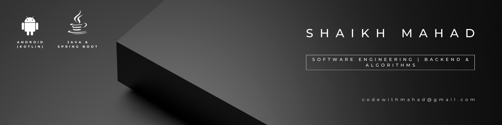

# ⚡ Shaikh Mahad | Portfolio

> A high-performance portfolio designed for a Backend Systems Engineer, built with Next.js and optimized for system-inspired aesthetics.

<div align="center">
  
</div>

## 📖 Overview
This portfolio is designed to be **lightweight, fast, and visually immersive**. It features a "glassmorphism" dark theme inspired by IDEs and terminal environments, reflecting a focus on Backend Engineering and System Internals.

### Key Features
- **Command Palette:** Quick navigation across sections via `Ctrl + K`.
- **Spotlight Effects:** Interactive glassmorphism cards that respond to mouse movement.
- **System-Inspired UI:** Dark theme with JetBrains Mono typography.
- **Performance:** Built with Next.js App Router for optimal loading speeds.
- **Analytics:** Integrated with Vercel Analytics and Speed Insights.

**Live Site:** [shaikhmahad.vercel.app](https://shaikhmahad.vercel.app)

## 🛠 Tech Stack
- **Framework:** [Next.js](https://nextjs.org/) (App Router)
- **Library:** [React 19](https://reactjs.org/)
- **Styling:** [Tailwind CSS 4](https://tailwindcss.com/)
- **Insights:** Vercel Analytics & Speed Insights
- **Typography:** JetBrains Mono & Inter

## 📂 Project Structure
```text
.
├── Portfolio/           # Main Next.js application
│   ├── app/             # Next.js App Router (pages, components, styles)
│   ├── public/          # Static assets (images, icons, robots.txt)
│   ├── package.json     # Dependencies and scripts
│   └── next.config.mjs  # Next.js configuration
├── LICENSE              # MIT License
└── README.md            # Root documentation
```

## 🚀 Getting Started

### Requirements
- **Node.js:** 18.x or higher
- **Package Manager:** npm (recommended), yarn, pnpm, or bun

### Installation
1. Clone the repository:
   ```bash
   git clone <repository-url>
   ```
2. Navigate to the project directory:
   ```bash
   cd Portfolio
   ```
3. Install dependencies:
   ```bash
   npm install
   ```

### Running Locally
- **Development Mode:**
  ```bash
  npm run dev
  ```
  The site will be available at `http://localhost:3000`.

- **Production Build:**
  ```bash
  npm run build
  npm run start
  ```

## 📜 Scripts
Defined in `Portfolio/package.json`:
- `dev`: Runs `next dev` - Start development server.
- `build`: Runs `next build` - Build the application for production.
- `start`: Runs `next start` - Start the production server.
- `lint`: Runs `eslint` - Lint the codebase.

## 🌐 Environment Variables
| Variable | Description | Default |
|----------|-------------|---------|
| None | No manual environment variables required for local setup. | N/A |

> [!TIP]
> Vercel Analytics and Speed Insights are automatically enabled when deployed on the Vercel platform.

## 🧪 Tests
- [ ] TODO: Implement unit tests for UI components.
- [ ] TODO: Add integration tests for navigation and command palette.

## 📄 License
This project is licensed under the [MIT License](LICENSE).
